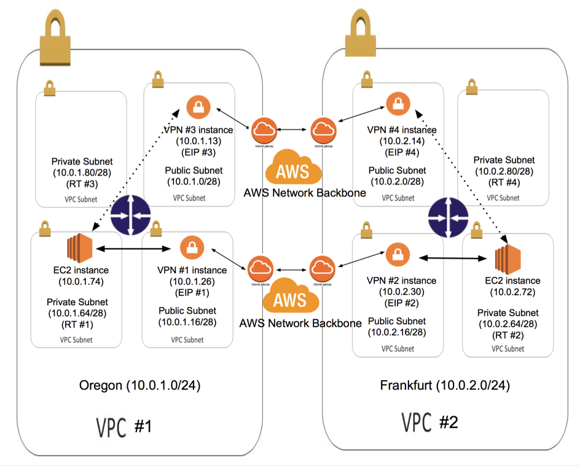

# ha-vpn-vpcs
High availability AWS cross-region VPC to VPC connection by SSH tunnel

## Example VPC Setup

This guide will use the following VPC configuration for illustrative purposes:




## Create VPN_Monitor EC2 role in IAM
you need to create an EC2 role that will grant the VPN instances permissions to take over routing in the event the other VPN instance fails. Create Custom Policy and enter the following Policy Document

```
{
    "Statement": [
        {
            "Action": [
                "ec2:ReplaceRoute",
                "ec2:StartInstances",
                "ec2:RebootInstances"
            ],
            "Effect": "Allow",
            "Resource": "*"
        }
    ]
}

```

## To launch Amazon EC2 instances for VPN

1. Launch four Amazon Linux instances, one in each VPC public subnet, with the following characteristics:
  1. Allocate four VPC EIPs and associate an EIP to each VPN instance.
  * Select VPN_Monitor for IAM Role
* Disable Source/Dest checking on both instances by right-clicking on the instances and selecting Change Source/Dest. Check.  
* Configure Routing Tables in each VPC private subnet to send traffic to the "other" VPC through the VPC VPN instances. 

## To configure sshd config on VPN instances
1. Connect to each VPN Instance and su as root  
  ```  
  Prompt> sudo su -  
  
  ```  
* Generate ssh key pair for root  
  ```  
  Prompt> ssh-keygen  
  
  ```  
* Add public key of other VPN instances to /root/.ssh/authorized_keys
* Edit the /etc/ssh/sshd_config file and make sure following options are yes  
  ```  
  Prompt> vi /etc/ssh/sshd_config  
  
  ```  
  ```  
  PermitTunnel yes  
  PermitRootLogin yes  
  
  ```  

## Download and configure the vpn.sh script
1. Connect to VPN Instance and su as root  
  ```  
  Prompt> sudo su -  
  
  ```  
* download the vpn.sh script and make it executable  
  ```   
  Prompt> cd /root  
  Prompt> wget https://raw.githubusercontent.com/eric6239/ha-vpn-vpcs/master/vpn.sh  
  Prompt> chmod +x vpn.sh
  
  ```
* Edit the following variables to match your settings
  1. For VPN #1
    - **HA_REGION**: us-west-2
    - **HA_OTHER_LOCAL_IP**: 10.0.1.13
    - **HA_OTHER_LOCAL_ID**: Instance ID of VPN #3
    - **HA_OTHER_LOCAL_RT_ID**: RT #3
    - **HA_OTHER_REMOTE_IP**: 10.0.2.14
    - **HA_REMOTE_CIDR**: 10.0.2.0/24
    - **HA_REMOTE_IP**: 10.0.2.30
    - **LOCAL_CIDR**: 10.0.1.0/24
    - **REMOTE_CIDR**: 10.0.2.0/24
    - **REMOTE_EIP**: EIP #2
  1. For VPN #2
    - **HA_REGION**: eu-central-1
    - **HA_OTHER_LOCAL_IP**: 10.0.2.14
    - **HA_OTHER_LOCAL_ID**: Instance ID of VPN #4
    - **HA_OTHER_LOCAL_RT_ID**: RT #4
    - **HA_OTHER_REMOTE_IP**: 10.0.1.13
    - **HA_REMOTE_CIDR**: 10.0.1.0/24
    - **HA_REMOTE_IP**: 10.0.1.26
    - **LOCAL_CIDR**: 
    - **REMOTE_CIDR**: 
    - **REMOTE_EIP**: 
  1. For VPN #3
    - **HA_REGION**: us-west-2
    - **HA_OTHER_LOCAL_IP**: 10.0.1.26
    - **HA_OTHER_LOCAL_ID**: Instance ID of VPN #1
    - **HA_OTHER_LOCAL_RT_ID**: RT #1
    - **HA_OTHER_REMOTE_IP**: 10.0.2.30
    - **HA_REMOTE_CIDR**: 10.0.2.0/24
    - **HA_REMOTE_IP**: 10.0.2.14
    - **LOCAL_CIDR**: 10.0.1.0/24
    - **REMOTE_CIDR**: 10.0.2.0/24
    - **REMOTE_EIP**: EIP #4
  1. For VPN #4
    - **HA_REGION**: eu-central-1
    - **HA_OTHER_LOCAL_IP**: 10.0.2.30
    - **HA_OTHER_LOCAL_ID**: Instance ID of VPN #2
    - **HA_OTHER_LOCAL_RT_ID**: RT #2
    - **HA_OTHER_REMOTE_IP**: 10.0.1.26
    - **HA_REMOTE_CIDR**: 10.0.1.0/24
    - **HA_REMOTE_IP**: 10.0.1.13
    - **LOCAL_CIDR**: 
    - **REMOTE_CIDR**: 
    - **REMOTE_EIP**: 
* Configure vpn.sh to be started by cron at boot  
  ```
  Prompt> echo '@reboot /root/vpn.sh >> /var/log/vpn.log' | crontab
  
  ```

## Reboot VPN Instance
1. Connect to each VPN Instance
  ```  
  Prompt> sudo reboot
  
  ```  

## Test VPN status
1. Connect to VPN #1 and ping VPN #2 Instance
  ```  
  Prompt> ping 10.0.2.30
  
  ```  

## Reference

- <a href="https://aws.amazon.com/articles/5472675506466066" target="_blank">Connecting Multiple VPCs with EC2 Instances (IPSec)</a>
- <a href="https://aws.amazon.com/articles/2781451301784570" target="_blank">High Availability for Amazon VPC NAT Instances: An Example</a>


## License

Copyright (c) 2016 Eric Chang

Licensed under the [MIT License](LICENSE).
